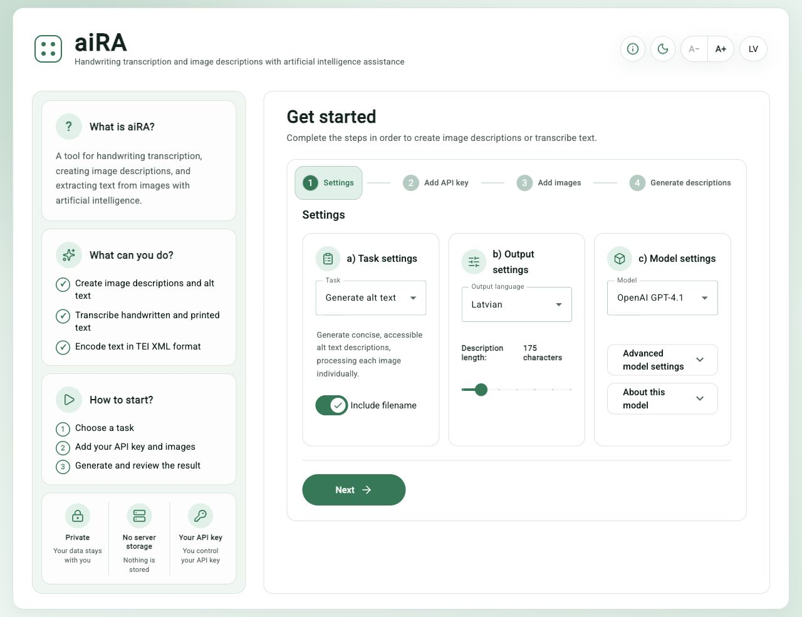

# aiRA – Handwriting Transcription and Image Descriptions

aiRA is a browser-based web application for generating accessible image descriptions and alt text, transcribing handwritten and printed text, and encoding transcriptions as [TEI XML](https://tei-c.org/) with the help of artificial intelligence.

The application supports OpenAI and Google Gemini vision models. A personal OpenAI or Google API key is required to use the AI features.

aiRA is a frontend-only application and does not require an application backend. Images, text, and API keys are sent directly from the user's browser to the selected AI provider. They do not pass through an aiRA server.

## Screenshot



## Features

- Generate image descriptions and accessible alt text
- Transcribe handwritten and printed text
- Process individual images or image batches
- Encode transcriptions as TEI XML
- Use OpenAI and Google Gemini vision models
- Edit, translate, copy, and export generated results
- Switch between Latvian and English without reloading the application or losing entered data
- Use light and dark colour themes
- Increase or decrease the interface text size
- Retain language, theme, and text-size preferences between visits

## Direct Links

The interface uses URL fragments that can be shared:

- `#lv` opens the Latvian interface
- `#en` opens the English interface
- `#info` opens the information section

An explicit `#lv` or `#en` link overrides the saved interface language. Other interface preferences are stored locally in the browser.

## Technology

aiRA is built with:

- [Angular](https://angular.dev/)
- [Angular Material](https://material.angular.io/)
- [Lucide](https://lucide.dev/) icons
- [OpenAI JavaScript SDK](https://github.com/openai/openai-node)
- [Google Gen AI SDK](https://github.com/googleapis/js-genai)

## Development Setup

### Prerequisites

Install [Node.js](https://nodejs.org/), which includes `npm`. Based on the Angular 21 compatibility requirements, use Node.js `^20.19.0`, `^22.12.0`, or `^24.0.0`.

Check the installed versions:

```bash
node --version
npm --version
```

### Install the Project

```bash
git clone https://github.com/ul-dhc/aiRA.git
cd aiRA
npm install
```

A global Angular CLI installation is not required because the required CLI version is included in the project's development dependencies.

## Run the Local Development Server

```bash
npm start
```

Open [http://localhost:4200/](http://localhost:4200/). The development server automatically rebuilds and reloads the application when source files change.

Localised interface links:

- [http://localhost:4200/#lv](http://localhost:4200/#lv)
- [http://localhost:4200/#en](http://localhost:4200/#en)

## Testing

Run the test suite:

```bash
npm test
```

Run tests in watch mode:

```bash
npm run test:watch
```

## Production Build

```bash
npm run build
```

The compiled application is written to `dist/browser/`.

For deployment to this repository's GitHub Pages project site, build with the repository base path:

```bash
npm run build -- --base-href /aiRA/
```

Publish the contents of `dist/browser/`, not the Angular source directory.

## Docker

Build a local Docker image:

```bash
docker build -t aira .
```

Run the application on port `8082`:

```bash
docker run --rm -p 8082:80 aira
```

Then open [http://localhost:8082/](http://localhost:8082/).

## Configuration

### AI Models

Available OpenAI and Google Gemini models are defined in [`src/assets/config/models.ts`](src/assets/config/models.ts).

Each model configuration describes its provider, API identifier, supported tasks, pricing information, request limits, image parameters, and model-specific reasoning or thinking controls.

### Tasks, Languages, and Prompts

Task and output-language configuration is defined in [`src/assets/config/prompts.ts`](src/assets/config/prompts.ts). Prompt text is stored in separate files under [`src/assets/prompts/`](src/assets/prompts/).

Placeholders such as `{{FILENAME}}` and `{{DESC_LENGTH}}` are replaced at runtime with values from the user's settings.

### Interface Translations

Interface translations and runtime language switching are implemented in [`src/app/i18n/`](src/app/i18n/).

## Updating Dependencies

Update Angular packages together:

```bash
npx ng update @angular/cli @angular/core @angular/cdk @angular/material
```

Before changing the Angular major version, consult the [Angular Update Guide](https://angular.dev/update-guide) and [version compatibility table](https://angular.dev/reference/versions).

After updating other dependencies in [`package.json`](package.json), run:

```bash
npm install
```

Commit both `package.json` and the updated `package-lock.json`.

## Privacy and API Keys

- The user supplies and controls their own API key.
- aiRA maintainers cannot see the user's API key, images, text, or generated results.
- AI usage costs and data-processing terms are determined by OpenAI or Google according to the user's account and selected model.
- Do not save an API key in the browser when using a public or shared computer.

## Project and Credits

aiRA was developed by the [Digital Humanities Centre at the University of Latvia](https://ul-dhc.github.io/) within the [ȬPEN project](https://www.hzf.lu.lv/petnieciba/projekti/open/), No. ZDA-LIP 2025/2.

aiRA is an adaptation of [aBBi](https://github.com/slsfi/abbi-ng-ai-image-descriptor), an open-source tool developed by the Society of Swedish Literature in Finland, Svenska litteratursällskapet i Finland, SLS.

Original aBBi author: Sebastian Köhler, 2024.

## Changelog

See [`CHANGELOG.md`](CHANGELOG.md) for the project history.

## Licence

This project is distributed under the terms described in [`LICENSE`](LICENSE).
